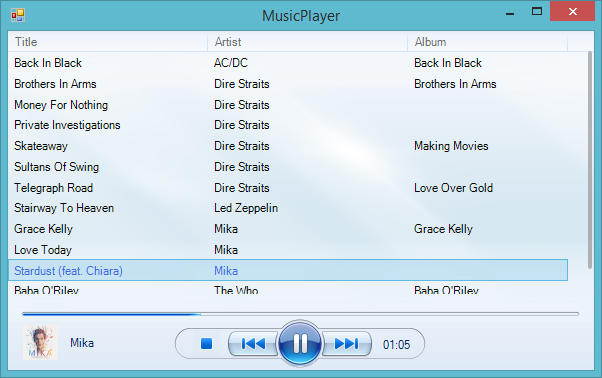
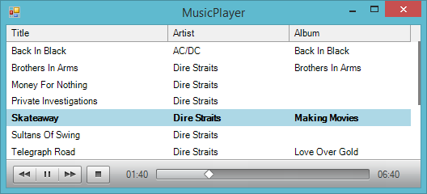
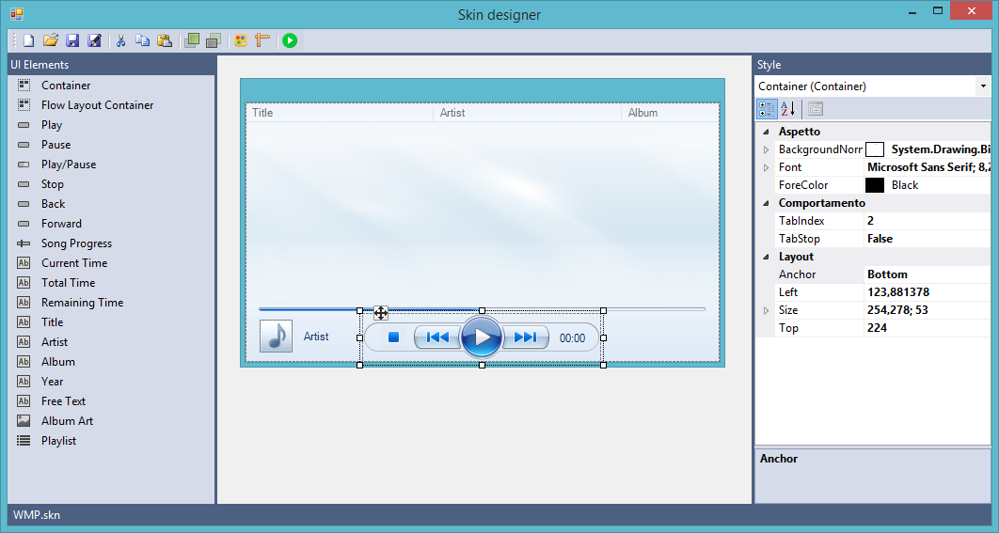

SkinnableUI
===========

Library for skinnable user interfaces in Windows Forms.

This library lets you create totally skinnable Windows Forms applications. Please note that the toolkit is not complete yet, and some of the functionalities that your app requires might not be available. Nonetheless, extending the library should be a very easy task.

Example
-------

Included in this repository, as an example, there is a skinnable music player:

Graphical skin designer included
--------------------------------

In this repository you'll find a graphical skin designer too.

Note that you can use [NinePatch](http://developer.android.com/guide/topics/graphics/2d-graphics.html#nine-patch) images to style almost any control. You can find some interesting examples in [SkinsSources/MacSkin/](/SkinsSources/MacSkin/).

